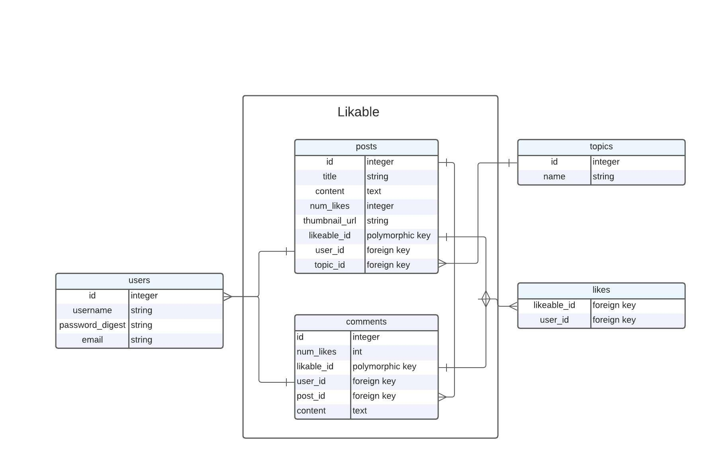

# Freddit

Reddit Clone built for Flatiron Phase 4 Backend Project requirement.

Freddit makes use of a PostgreSQL database with the following database structure:

Freddit is currently in an alpha stage of development. While we have implemented user signup, login, and authentication, as well as posting, commenting and upvoted, several features have yet to be implemented.

Key areas for improvement include:
- The ability to make nested comment threads
- The ability to display and edit account information
- The ability to display user comments via their profile
